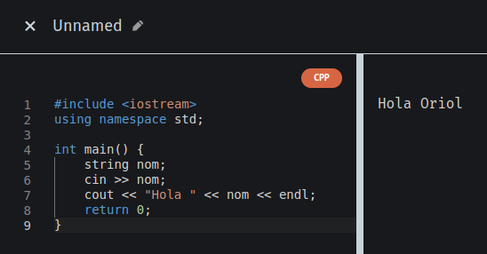
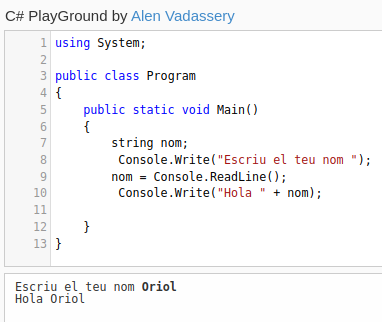

# Activitat de recerca de llenguatges de programació

## **Java** 
Actualment es el 3 llenguatge més utilitzat i es va crear al 1996 per Sun Microsystems,

Java ha sigut un llenguatge que ha servit de base per a molts llenguatges com per exemple C#, J#, Javascript, PHP o Python.

Java es un llenguatge compilat a bytecode orientat a objectes i es imperatiu, la seva sintaxis es pareguda a la de C o C++ pero te menys utilitats de baix nivell.

**Característiques**
- Imperatiu
- Interpretat
- Orientat a objectes

**Avantatges**
- Es simple
- Orientat a objectes
- Es multiplataforma
- Es segur

**Desavantatge**
- El rendiment es pot veure afectat
- Requereix una gran quantitat de memòria

## **Python** 
Python actualment es el llenguatge més utilitzat i es va crear al 1991 per van Rossum 

Python es un sistema multiplataforma orientada a objectes, imperatiu i de codi obert, una de les seves avantatges és que és molt fàcil de llegir i escriure ja que té una gran similitud amb el llenguatge humà.

Es va inspirar en llenguatges com java o perl i ha influït a llenguatges com JavaScript, Ruby o Go

**Característiques:**
- Imperatiu
- Interpretat
- Orientat a objectes
-
**Avantatges**
- Fàcil d'utilitzar
- Orientat a objectes
- Multiplataforma

**Desavantatge**
-
-
-

## **C++**  
Aquest és el 4 llenguatge més utilitzat i es va crear al 1979 per bjarne Stroustrup 	

Aquest és un llenguatge de programació estructurada i imperatiu, la última versió amb proves va ser al 2020 i es deia C++20.

Un dels seus principals avantatges es que els programes tindran menys error perquè la sintaxis es mes estrica, també es molt ràpid i eficient a l’hora d’executar els programes 

**Característiques:**
- Imperatiu
- Compilat
-
-
**Avantatges**
-
-
-

**Desavantatge**
-
-
-

## **C#** 
Es el 5 llenguatge més utilitzat i es va crear a l'any 2000 per Anders Hejlsberg, el creador es va inspirar amb Java, C++, Eiffel, Modula-3 i Pascal, també ha sigut un dels que ha influït a D, F#, Java 5 o Vala.

El creador ja havia participat en el desenvolupament d'altres llenguatges com Turbo Pascal, Delphi i J++.

Aquest llenguatge és imperatiu i orientat a objectes i una de les seves avantatges és que és més senzill d’utilitzar que c++ ja que c# intenta simplificar la sintaxis per a que sigui més logica, també al tindre suport amb altres plataformes les empreses prefereixen utilitzar aquest llenguatges abans que c++-

**Característiques:**
- Imperatiu
- Compilat
-
-
**Avantatges**
-
-
-

**Desavantatge**
-
-
-

# EXEMPLES DE CODI

## **Java**

Hola Mon amb Java

Demanar el nom d’usuari amb Java

## **Python**

Hola Mon amb Python

Demanar el nom d’usuari amb Python

## **C++** 

Hola mon amb C++

Demanar nom d’usuari amb C++

## **C#**

Hola mon amb C#

Demanar nom d’usuari amb C#

# INFOJOBS

## **JAVA**

Aquesta oferta de treball pots treballar amb el títol de cicle superior si tens almenys una experiencia de treball de 2 anys, es a sevilla i te que ser obligadament presencial, en general es cobra molt bé amb aquell llenguatge

Aquest treball té la ventatja de que es pot treballar desde casa i no fa falta que vagi a la empresa per a treballar, necessites una experiencia mínima de 5 anys amb un molt bon sou,

## **PYTHON**

Per a python he trobat moltes ofertes similar a les de java, però la majoria necessito ser programador senior i tindre 2 anys d'experiència amb el treball, en general tots els sou de programador estan molt ben pagats i en general aquest llenguatge s'utiliza amb l'ambit dels videojocs.

## **C++**

Aquest treball encara que necessites 2 anys d'experiència et permeten treballar remotament i només amb el títol secundaria obligatoria.

Aquesta és una de les poques ofertes amb només 1 any d'experiència mínim, la majoria d’ofertes que he trobat demanaven mínim 2 anys d'experiència i ser senior.

## **C#**

Amb C# he trobat moltes ofertes de treball telemàtic amb un bon sou, al ser similar a java les ofertes son molt similars. 

# WEBGRAFIA
<https://www.infojobs.net/>

<https://www.tiobe.com/tiobe-index/>

<https://github.com/>

<https://www.youtube.com/watch?v=u8nDlhqLqw8>

<https://odio-el-c-sharp.blogspot.com/2015/04/pedir-nombre-e-imprimirlo.html>

