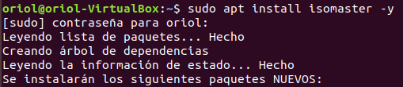
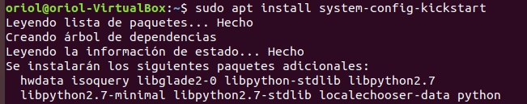
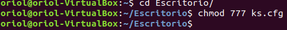

Administració de SistemesInformàtics en la Xarxa

Desenvolupamentd’Aplicacions Multiplataforma

**M1** – Implantació de SistemesOperatius

**UF3** – Implantació de ProgramariEspecífic

**Instal·lació desatesa amb fitxer de resposta**

Per a fer una instal·lació desatesa amb Ubuntu existeixen dues opcions, la primera és fer-ho amb el kickstart, la qual té l’avantatja que és més senzilla d’utilitzar, però és menys completa. L’altra és amb el preseed, és més complexa, però la configuració és molt més extensa.

Recursos necessaris:

- Màquina base amfitrió Ubuntu 14.04, Ubuntu 16.04...
- Alguna .iso versió alternate o server **DINTRE** de la MV amfitrió
- Instal·lació del isomaster

Utilitzo la seguent comanda

**\*\*\* Enlloc de l’isomaster es pot fer ús de rsync per a extreure tot lo de la iso i desprès mkisofs per a tornar a generar-la**

1. Realitza la instal·lació desatesa amb el kickstart d'un SO Ubuntu
   1. Actualitza repositoris

1. Instal·la system-config-kickstart

1. Obre amb system-config-kickstart i configura els paràmetre que creguis necessaris

He modificat el idioma default a catala, el teclat a l’español i la hora

d

f

d

d

d

d

1. Guarda l’arxiu ks.cfg a l’escritori mateix

Guardo l’arxiu ks.cfg a l’escritori

Li dono tots el permisos per a poder modificar-ho

1. Obre la .iso alternate o server amb l’isomaster i posa a l’arrel l’arxiu ks.cfg

d

d

1. Amb l’isomaster extreu l’arxiu txt.cfg a l’escritori mateix, i modifca’l per tal d’afegir una opció més al menú. Copia la primera opció, caniva el nom i afegeix al final ks=cdrom:/ks.cfg

d

1. Guarda els canvis

1. Posa aquets arxiu modificat dintre la iso, esborrant primer l’antic

D

1. Guarda la iso

Guardo la iso amb el nom OriolDesates

1. Prova que funcioni en una nova màquina virtual
1. Realitza la instal·lació desatesa amb el pressed d'un SO Ubuntu. El concepte és el mateix, generar un arxiu de resposta, però enlloc del kickstart amb el pressed i desprès posar-lo dintre la iso.
   1. Cerca per internet un arxiu preseed.cfg i modifica’l
   1. Llavors cal que el posis dintre la iso i que modifiquis el txt.cfg afegint una nova opció per a que l’agafi
   1. Prova la iso en una nova màquina virtual

